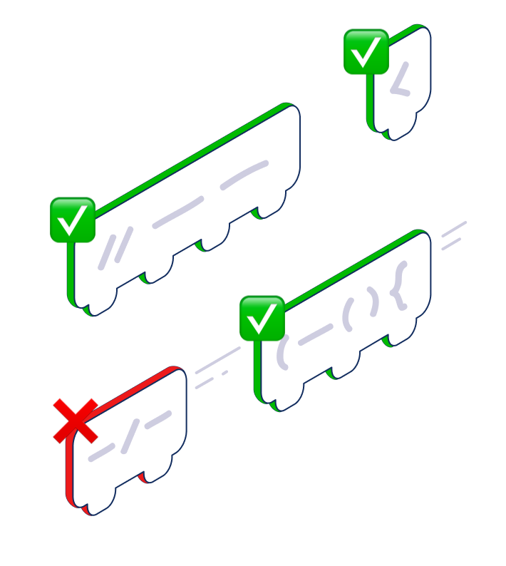

<p align="center">
<br/>
<br/>
   
<br/>
<br/>
</p>
<p align="center">
<hr/>
</p>

<p align="center">


</p>

# Bumblefootlib


## Quick Start

Add to `Cargo.toml`


```ini
bumblefoot_lib = "*"
```

## Example

# Thanks

To all [Contributors](https://github.com/jondot/bumblefoot-lib/graphs/contributors) - you make this happen, thanks!


# Copyright

Copyright (c) 2021 [@jondot](http://twitter.com/jondot). See [LICENSE](LICENSE.txt) for further details.


